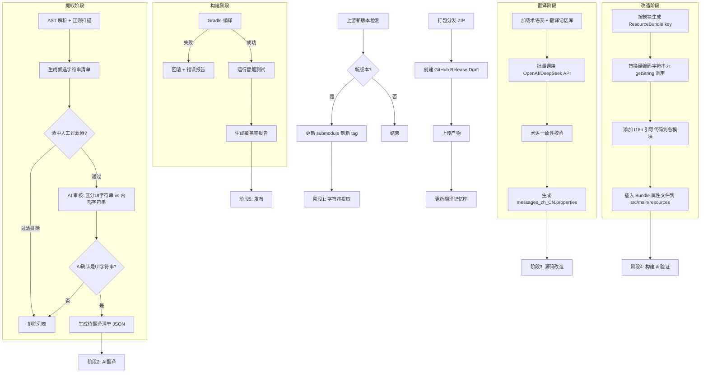
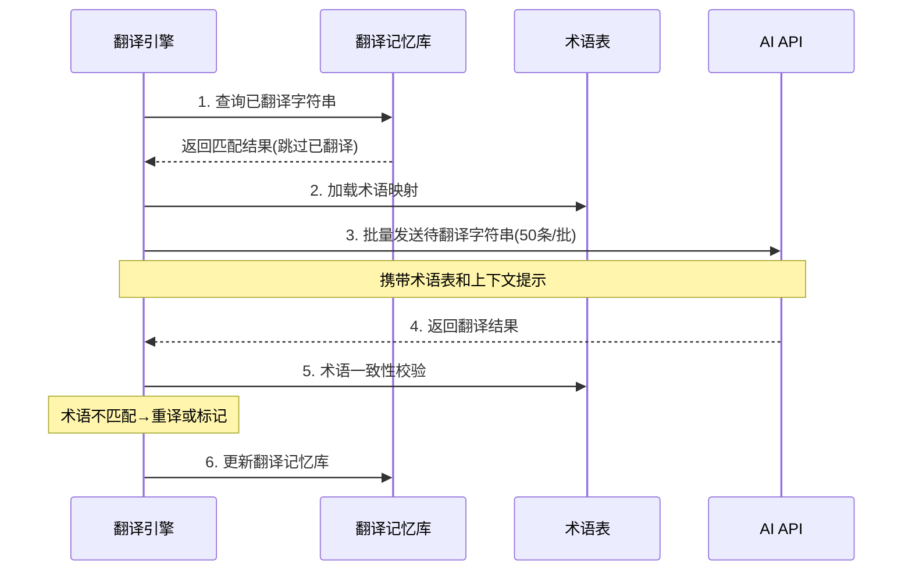
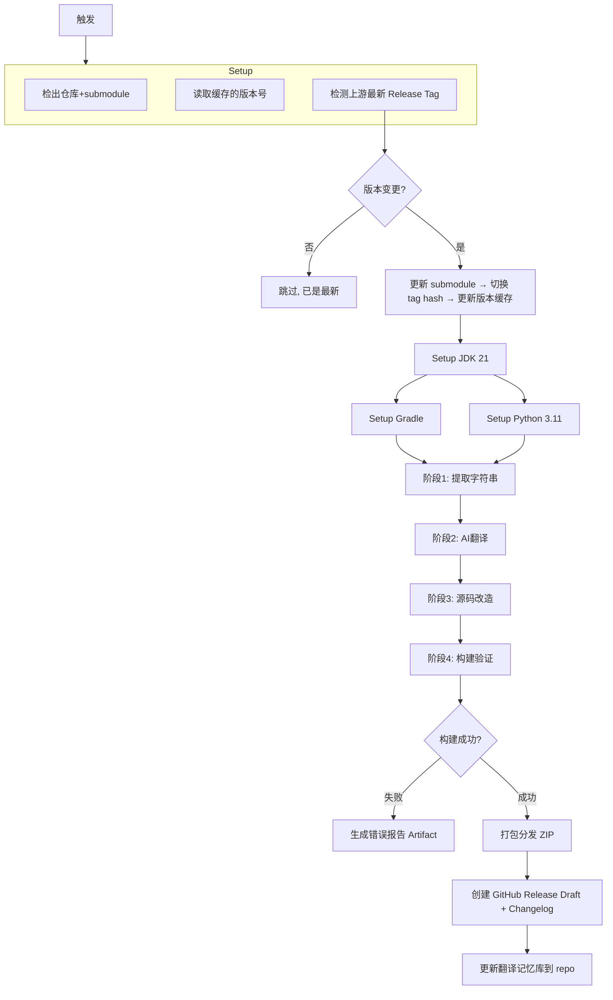

# Ghidra I18N 自动化流水线计划 (PLAN)

> **目标**：构建 AI 驱动的 Ghidra 国际化流水线，实现「AI 提取前端字符串 → AI 翻译 → 构建国际化发行版 → GitHub Releases 发布」全自动化。

---

## 1. 项目概述

### 1.1 核心目标

将 Ghidra（NSA 逆向工程平台）进行**完整国际化改造**，支持简体中文（后续扩展多语言框架），通过 GitHub Actions 全自动化完成提取、翻译、构建、发布。

### 1.2 技术策略总览

| 决策点 | 方案 |
|--------|------|
| **国际化改造模式** | 完整改造（直接修改源码，硬编码字符串 → ResourceBundle 调用） |
| **字符串提取** | 正则/AST 初筛 → AI 审核过滤 → 人工可控过滤器 → 自动生成改造代码 |
| **ResourceBundle 架构** | 按 Gradle 子模块划分 bundle（如 `DockingMessages.properties`） |
| **Patch 管理** | 脚本驱动（确定性改造），CI 每次从源码重新生成 |
| **AI 翻译 API** | OpenAI（`OPENAI_API_KEY`）+ DeepSeek（`DEEPSEEK_API_KEY`） |
| **多语言策略** | 初期简中 zh_CN，预留多语言扩展框架 |
| **上游跟踪** | 检测 NSA 新正式版本 → 更新 submodule → 切换 tag hash |
| **发布形式** | GitHub Releases，发布完整 i18n 版 zip 包 |
| **切语言方式** | JVM 参数 `-Duser.language=zh -Duser.country=CN` |
| **初始版本** | Ghidra 12.2 DEV Pre-Release |

---

## 2. 项目仓库架构

```
ghidra-i18n/                          （主仓库）
├── ghidra/                           （上游 Ghidra submodule，只读，不直接修改）
├── i18n-scripts/                     （国际化工具脚本集）
│   ├── extract/                      （提取阶段）
│   │   ├── StringExtractor.java      （AST 解析器：识别硬编码 UI 字符串）
│   │   ├── RegexScanner.java         （正则回退扫描器）
│   │   └── filters/                  （人工可控过滤器）
│   │       ├── filter-config.yml     （过滤规则配置）
│   │       ├── exclude-patterns.txt  （排除模式：日志/异常/内部常量）
│   │       └── manual-approvals.yml  （人工审批标记）
│   ├── translate/                    （翻译阶段）
│   │   ├── TranslationEngine.java    （通用翻译引擎）
│   │   ├── providers/
│   │   │   ├── OpenAiProvider.java   （OpenAI API 翻译）
│   │   │   └── DeepSeekProvider.java （DeepSeek API 翻译）
│   │   └── glossary.yml             （术语表，确保翻译一致性）
│   ├── transform/                    （改造阶段）
│   │   ├── SourceTransformer.java    （源码改造器：硬编码 → ResourceBundle 调用）
│   │   ├── BundleGenerator.java      （生成 messages_*.properties 文件）
│   │   └── I18nBootstrapper.java     （生成 ResourceBundle 加载引导代码）
│   └── validate/                     （验证阶段）
│       ├── BuildValidator.java       （编译验证）
│       └── CoverageReporter.java     （翻译覆盖率报告）
├── glossary/                         （术语表与翻译记忆库）
│   └── zh_CN/
│       ├── ghida-terms.yml           （Ghidra 专有术语）
│       └── translation-memory.json   （翻译记忆库，避免重复翻译）
├── .github/
│   └── workflows/
│       ├── i18n-pipeline.yml         （主流水线）
│       ├── check-upstream-release.yml（上游版本检测）
│       └── nightly-translation.yml   （每日翻译质量检查）
└── doc/
    └── PLAN.md                       （本计划文档）
```

---

## 3. 架构设计

### 3.1 总体流程



### 3.2 ResourceBundle 架构设计

#### 模块划分

每个 Gradle 子模块一个独立的 ResourceBundle，bundle 名称为 `{ModuleName}Messages`：

```
Ghidra/Framework/Docking/
  src/main/resources/
    └── ghidra/framework/docking/
        ├── DockingMessages.properties          （英文原文）
        └── DockingMessages_zh_CN.properties    （简体中文）
```

#### Key 命名规则

```
{ClassName}.{field/component}.{context}

示例:
  LaunchErrorDialog.title=Unable to Launch Manual Viewer
  LaunchErrorDialog.button.edit=Edit Settings
  LaunchErrorDialog.button.cancel=Cancel
  LaunchErrorDialog.label.url=URL: 
```

#### Java 引导代码

每个需要国际化的模块在 module 根包中新增一个轻量级引导类：

```java
// Ghidra/Framework/Docking/src/main/java/ghidra/framework/docking/I18nDocking.java
package ghidra.framework.docking;

import java.util.ResourceBundle;
import java.util.Locale;

public class I18nDocking {
    private static final String BUNDLE_NAME = 
        "ghidra.framework.docking.DockingMessages";
    private static ResourceBundle bundle;

    public static String get(String key) {
        if (bundle == null) {
            Locale locale = Locale.getDefault();
            bundle = ResourceBundle.getBundle(BUNDLE_NAME, locale);
        }
        return bundle.getString(key);
    }
}
```

#### 改造目标代码示例

**改造前：**
```java
setTitle("Unable to Launch Manual Viewer");
JButton editButton = new JButton("Edit Settings");
```

**改造后：**
```java
import static ghidra.framework.docking.I18nDocking.get;
// ...
setTitle(get("LaunchErrorDialog.title"));
JButton editButton = new JButton(get("LaunchErrorDialog.button.edit"));
```

---

## 4. 技术实现细节

### 4.1 字符串提取引擎

#### 4.1.1 扫描模式

| 优先级 | 模式 | 示例 |
|--------|------|------|
| P0 | `.setTitle("...")` | `setTitle("Error")` |
| P0 | `.setToolTipText("...")` | `setToolTipText("Click to open")` |
| P0 | `new JLabel("...")` / `new GLabel("...")` | `new GLabel("URL: ")` |
| P0 | `new JButton("...")` | `new JButton("Cancel")` |
| P0 | `new JMenuItem("...")` / `new JMenu("...")` | 菜单字符串 |
| P0 | `new JCheckBox("...")` / `new JRadioButton("...")` | 复选框/单选按钮文本 |
| P0 | `new GHtmlLabel("<html>...")` | HTML 格式的提示文本 |
| P1 | `@PluginInfo(shortDescription="...")` | 注解中的描述文本 |
| P1 | `@PluginInfo(description="...")` | 注解中的描述文本 |
| P1 | `OptionDialog.show*(..., "...")` | 对话框消息 |
| P1 | `DockingAction` 名称/描述 | `new DockingAction("name", ...)` |
| P2 | HTML help 文件中的可见文本 | `<h1>Configuration</h1>` |
| P2 | Python 脚本 print/UI 字符串 | `print("Processing done")` |

#### 4.1.2 AI 审核过滤器

AI 审核的核心任务是区分**面向用户的 UI 字符串**和**内部字符串**：

| 类型 | 判断标准 | 示例 |
|------|----------|------|
| ✅ UI 字符串 | 通过 Swing/AWT/插件注解显示给用户 | `"Cancel"`, `"Unable to Launch"` |
| ❌ 日志/调试 | Msg.error/warn/info/debug 的第一个参数 | `Msg.error(this, "Error: " + e)` |
| ❌ 异常消息 | Exception 构造参数、内部断言 | `new IllegalArgumentException("Invalid")` |
| ❌ 空字符串 | `""` | 约定标记 |
| ❌ 单字符标点 | 分隔符、括号 | `":"`, `", "`, `"["` |
| ❌ 代码标识符 | 固定协议字符串、key | `"application.gradle.min"`, `"https://"` |

**过滤器配置 (`filter-config.yml`)：**
```yaml
filters:
  # 排除特定 API 的字符串参数
  exclude_apis:
    - "Msg.error"
    - "Msg.warn"
    - "Msg.info"
    - "Msg.debug"
    - "Msg.trace"
    - "IllegalArgumentException("
    - "AssertException("
    - "Objects.requireNonNull"
  
  # 排除非字符串字面量上下文
  exclude_contexts:
    - "throw new"
    - "logger."
    - "LOG."
  
  # 模式排除
  exclude_patterns:
    - '^$'              # 空字符串
    - '^[\[\]{}()/:,;.\-_+=*&^%$#@!~`<>?\\|\s]+$'  # 纯标点
    - '^[A-Z_]+$'       # 全大写（通常是代码常量）
    - '^https?:'        # URL
    - '^\d'             # 以数字开头
    - '^[a-z]+(\.[a-z]+)+$'  # package/路径模式
```

#### 4.1.3 人工审批流程

1. 流水线生成 JSON 格式的**审核清单**（待审批的字符串列表）
2. 维护者在 `manual-approvals.yml` 中标记确认/拒绝
3. 标记为 `rejected` 的字符串永久加入排除列表
4. 标记为 `approved` 的字符串在下一次上游变更时重新审核

### 4.2 翻译引擎

#### 4.2.1 多 Provider 策略

```
DeepSeek API (默认，成本低) → 批量翻译主体
OpenAI API (备用/高精度)   → 术语校准、不确定项重译
```

#### 4.2.2 翻译流程



#### 4.2.3 AI Prompt 设计

```
你是 Ghidra 逆向工程工具的 UI 翻译专家。
请将以下 Java Swing UI 字符串翻译为简体中文。

翻译规则：
1. 使用专业逆向工程术语，参考术语表
2. 保持按钮/标签的简洁性（中文通常比英文短）
3. HTML 标签 <b>, <br>, <font> 必须原样保留
4. 快捷键标记 &X 转换为中文时对应的括号形式
5. 字符串中的 %s, %d 等格式化占位符必须保留

术语表（部分）：
Program         → 程序
Function        → 函数
Disassemble     → 反汇编
Decompile       → 反编译
Breakpoint      → 断点
Memory          → 内存
Register        → 寄存器
Stack Frame     → 栈帧
Listing         → 列表视图
Plugin          → 插件
Extension       → 扩展

待翻译字符串：
1. "Unable to Launch Manual Viewer"
2. "Click <b>Edit Settings</b> to change the manual viewer launch settings"
3. "Cancel"
...

请以 JSON 格式返回：
{"1": "...", "2": "...", "3": "..."}
```

#### 4.2.4 术语表管理 (`glossary/zh_CN/ghidra-terms.yml`)

```yaml
# Ghidra 核心概念
Program: 程序
Function: 函数
Data: 数据
Listing: 列表视图
Disassemble: 反汇编
Decompile: 反编译

# 动作/操作
Analyze: 分析
Import: 导入
Export: 导出
Patch: 修补
Search: 搜索
Clear: 清除

# GUI 组件
Dialog: 对话框
Panel: 面板
Provider: 提供器
Action: 操作
Toolbar: 工具栏
StatusBar: 状态栏

# 开发术语
Repository: 仓库
Checkout: 检出
Commit: 提交
Merge: 合并
Conflict: 冲突
```

### 4.3 源码改造器

#### 4.3.1 确定性改造原则

- 输入相同源码 + 相同翻译数据 → 输出相同改造结果
- 不依赖任何外部状态或时间戳
- 可使用 Git diff 验证改造只影响字符串相关部分

#### 4.3.2 改造步骤

1. 解析 Java AST（使用 JavaParser 库）
2. 识别所有字符串字面量节点
3. 匹配提取阶段的候选清单
4. 生成 `{ClassName}.{field}.{context}` key
5. 替换字符串字面量为 `I18n{Bundle}.get("key")` 调用
6. 添加 `import static` 引用
7. 生成对应的 `messages.properties`
8. 写入 `src/main/resources/` 对应路径

#### 4.3.3 Bundle 文件放置策略

| 模块 | Bundle 路径 |
|------|-------------|
| `Ghidra/Framework/Docking` | `src/main/resources/ghidra/framework/docking/DockingMessages.properties` |
| `Ghidra/Features/Base` | `src/main/resources/ghidra/app/plugin/core/base/BaseMessages.properties` |
| `Ghidra/Debug/Debugger` | `src/main/resources/ghidra/app/plugin/core/debug/DebuggerMessages.properties` |

---

## 5. CI/CD 流水线设计

### 5.1 主流水线：`i18n-pipeline.yml`

**触发条件：**
- `workflow_dispatch`（手动触发）
- `repository_dispatch`（上游版本检测触发）
- `schedule`（每周检测一次）



### 5.2 上游版本检测：`check-upstream-release.yml`

```yaml
name: Check Upstream Release
on:
  schedule:
    - cron: '0 0 * * 1'  # 每周一
  workflow_dispatch:

jobs:
  check:
    runs-on: ubuntu-latest
    steps:
      - name: Fetch latest Ghidra release tag
        run: |
          LATEST=$(gh api repos/NationalSecurityAgency/ghidra/releases/latest --jq .tag_name)
          echo "LATEST_TAG=$LATEST" >> $GITHUB_ENV
          
      - name: Compare with cached version
        run: |
          if [ "$LATEST_TAG" != "$(cat .ghidra-version 2>/dev/null)" ]; then
            echo "NEW_VERSION=true" >> $GITHUB_ENV
          fi
          
      - name: Trigger I18N Pipeline
        if: env.NEW_VERSION == 'true'
        run: |
          gh workflow run i18n-pipeline.yml -f upstream_tag=$LATEST_TAG
```

### 5.3 密钥管理

使用 GitHub Repository Secrets 存储 API Key：

```yaml
env:
  OPENAI_API_KEY: ${{ secrets.OPENAI_API_KEY }}
  DEEPSEEK_API_KEY: ${{ secrets.DEEPSEEK_API_KEY }}
```

运行时 Python/Java 脚本通过环境变量读取。

---

## 6. 实施进度计划 (Milestone)

### Phase 1: 基础设施搭建（2-3 周）

| 任务 | 输出 | 验证方式 |
|------|------|----------|
| 1.1 创建项目目录结构 | `i18n-scripts/`, `glossary/`, `.github/workflows/` | 目录完整性检查 |
| 1.2 搭建 Gradle 子模块 | `i18n-scripts/build.gradle` | `gradle build` 通过 |
| 1.3 搭建 Python/Java 脚本框架 | `extract/`, `translate/`, `transform/` 包骨架 | 单元测试通过 |
| 1.4 配置 GitHub Actions 基础流水线 | `i18n-pipeline.yml` 骨架 | CI 空跑成功 |
| 1.5 配置 Secret 密钥 | 仓库 Settings → Secrets | 测试读取成功 |

### Phase 2: 提取引擎（3-4 周）

| 任务 | 输出 | 验证方式 |
|------|------|----------|
| 2.1 实现 AST 解析器 | JavaParser 集成 | 解析 Base 模块 4146 个文件正确 |
| 2.2 实现正则扫描器 | 回退模式覆盖 | 覆盖率 >98% |
| 2.3 实现过滤引擎 | `filter-config.yml` 规则引擎 | 排除率 >60%（非UI字符串被过滤） |
| 2.4 实现 AI 审核器 | AI 审核 pipeline | 误判率 <5% |
| 2.5 生成提取报告 | JSON 清单 + 统计 | 人工审核 |

### Phase 3: 翻译引擎（2-3 周）

| 任务 | 输出 | 验证方式 |
|------|------|----------|
| 3.1 编写术语表 | `glossary/zh_CN/ghidra-terms.yml`（300+条目） | 领域专家审查 |
| 3.2 实现 OpenAI Provider | `OpenAiProvider.java` | 单条翻译测试 |
| 3.3 实现 DeepSeek Provider | `DeepSeekProvider.java` | 批量翻译测试 |
| 3.4 实现翻译记忆库 | 去重、增量翻译 | 重复字符串跳过验证 |
| 3.5 实现术语校验 | 翻译后自动检查术语一致性 | 校验报告 |

### Phase 4: 源码改造器（3-4 周）

| 任务 | 输出 | 验证方式 |
|------|------|----------|
| 4.1 实现 Key 生成器 | 确定性命名算法 | Key 唯一性验证 |
| 4.2 实现 AST 替换引擎 | 字符串 → ResourceBundle 调用 | 编译通过 |
| 4.3 实现 Bundle 文件生成 | `messages_zh_CN.properties` | 格式正确性验证 |
| 4.4 实现引导代码注入 | `I18n{Module}.java` | 编译 + 可加载验证 |
| 4.5 实现 HTML help 翻译 | Help 文件生成 | HTML 格式正确性 |

### Phase 5: 构建与发布（2-3 周）

| 任务 | 输出 | 验证方式 |
|------|------|----------|
| 5.1 配置 Gradle 构建集成 | 修改 `javaProject.gradle` | 完整构建通过 |
| 5.2 实现编译验证 | `BuildValidator.java` | 编译错误报告 |
| 5.3 实现上游版本检测 | `check-upstream-release.yml` | 检测到新版本正确触发 |
| 5.4 实现 GitHub Release | 打包 + Changelog | Release Draft 正确生成 |
| 5.5 Pre-Release 测试 | Ghidra 12.2 DEV i18n 版 | 手动安装运行测试 |

### Phase 6: 优化与扩展（持续）

| 任务 | 输出 | 验证方式 |
|------|------|----------|
| 6.1 翻译覆盖率提升 | 覆盖率 >90% | 报告 |
| 6.2 多语言框架扩展 | 支持 zh_TW, ja_JP 等 | 新语言 bundle 可加载 |
| 6.3 性能优化 | 改造时间 <30min | CI 计时 |
| 6.4 社区反馈迭代 | Bug 修复 + 翻译修正 | Issue/PR |

---

## 7. 风险管理

| 风险 | 影响 | 缓解措施 |
|------|------|----------|
| **上游 API 变更** | 改造后代码无法编译 | 自动化编译验证 + 版本锁定 |
| **AI 翻译质量低** | 用户体验差 | 术语表约束 + 人工审核入口 + 翻译记忆库累积优化 |
| **构建时间过长** | CI 超时 | 增量翻译 + 缓存 + 并行翻译 |
| **ResourceBundle key 冲突** | 运行时字符串错乱 | 按模块隔离 + Key 唯一性校验 |
| **HTML 字符串格式化破坏** | Help 页面显示错误 | HTML 标签保留规则 + HTML 格式验证 |
| **上游频繁发布** | 流水线频繁运行 | 每周检测 + 手动触发为辅 |
| **API 调用成本** | 成本过高 | 翻译记忆库去重 + DeepSeek 优先（成本低） |

---

## 8. 关键技术选型

| 技术 | 用途 | 选型理由 |
|------|------|----------|
| **JavaParser** | Java AST 解析与修改 | Java 社区标准 AST 库，支持精确修改 |
| **Python 3.11** | 胶水脚本 & Pipeline 编排 | 生态丰富，AI SDK 成熟 |
| **Gradle** | 构建系统 | 与 Ghidra 原生构建一致 |
| **GitHub Actions** | CI/CD | 免费额度充足，与源码同仓库 |
| **OpenAI SDK** | 翻译 API 调用 | 标准 Python/Java SDK |
| **DeepSeek SDK** | 翻译 API 调用 | 成本低，中文翻译质量好 |
| **YAML** | 配置 & 术语表 | 人类可读写，结构化良好 |

---

## 9. 验收标准（Pre-Release）

- [ ] 160+ 个 Gradle 模块中 ≥90% 涉及的模块完成国际化改造
- [ ] 翻译覆盖的 UI 字符串 ≥5000 条
- [ ] 翻译记忆库累积 ≥2000 条
- [ ] 模块编译通过率 100%
- [ ] JVM 参数 `-Duser.language=zh -Duser.country=CN` 可切换至中文界面
- [ ] GitHub Release 包含完整 i18n zip 包
- [ ] 流水线全流程运行时间 <60 分钟

---

## 10. 后续扩展方向

1. **应用内语言切换**：基于 `ResourceBundle.clearCache()` + 窗口刷新，实现不重启切换语言
2. **社区翻译贡献**：开放 Crowdin/Weblate 集成
3. **多语言 RTL 支持**：阿拉伯语/希伯来语等 RTL 语言 UI 镜像
4. **Python 脚本国际化**：PyGhidra 脚本中的字符串也纳入翻译
5. **Ghidra 上游贡献**：将国际化基础设施向上游 NSA 提交 PR
