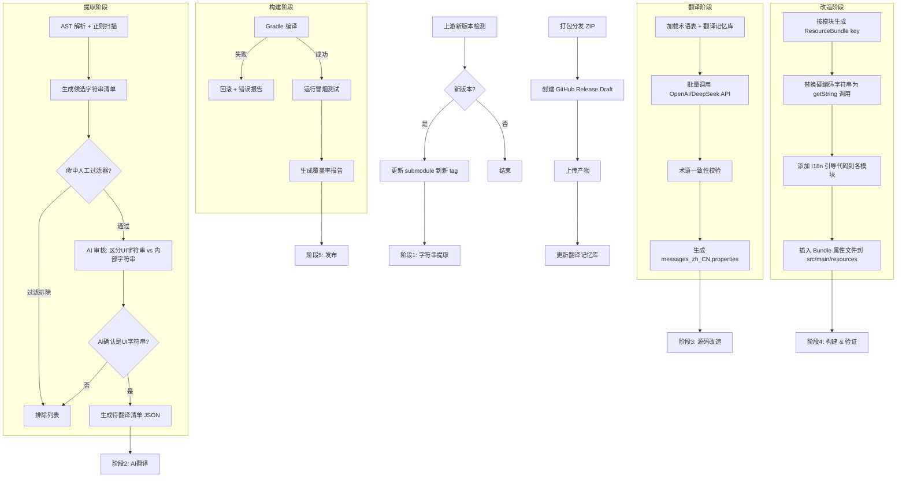
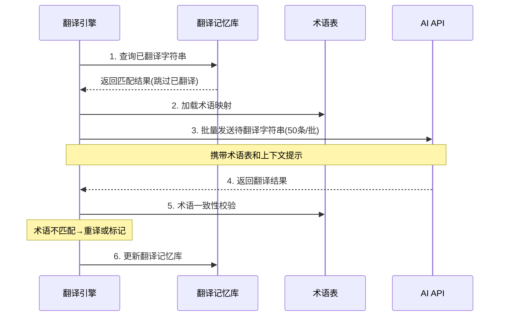
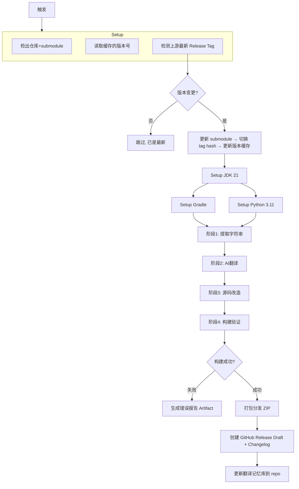

# Ghidra I18N 自动化流水线计划 (PLAN)

> **目标**：构建 AI 驱动的 Ghidra 国际化流水线，实现「AI 提取前端字符串 → AI 翻译 → 构建国际化发行版 → GitHub Releases 发布」全自动化。

---

## 1. 项目概述

### 1.1 核心目标

将 Ghidra（NSA 逆向工程平台）进行**完整国际化改造**，支持简体中文（后续扩展多语言框架），通过 GitHub Actions 全自动化完成提取、翻译、构建、发布。

### 1.2 技术策略总览

| 决策点 | 方案 |
|--------|------|
| **国际化改造模式** | 完整改造（直接修改源码，硬编码字符串 → ResourceBundle 调用） |
| **字符串提取** | 正则/AST 初筛 → AI 审核过滤 → 人工可控过滤器 → 自动生成改造代码 |
| **ResourceBundle 架构** | 按 Gradle 子模块划分 bundle（如 `DockingMessages.properties`） |
| **Patch 管理** | 脚本驱动（确定性改造），CI 每次从源码重新生成 |
| **AI 翻译 API** | OpenAI（`OPENAI_API_KEY`）+ DeepSeek（`DEEPSEEK_API_KEY`） |
| **多语言策略** | 初期简中 zh_CN，预留多语言扩展框架 |
| **上游跟踪** | 检测 NSA 新正式版本 → 更新 submodule → 切换 tag hash |
| **发布形式** | GitHub Releases，发布完整 i18n 版 zip 包 |
| **切语言方式** | JVM 参数 `-Duser.language=zh -Duser.country=CN` |
| **初始版本** | Ghidra 12.2 DEV Pre-Release |

---

## 2. 项目仓库架构

```
ghidra-i18n/                          （主仓库）
├── ghidra/                           （上游 Ghidra submodule，只读，不直接修改）
├── i18n-scripts/                     （国际化工具脚本集）
│   ├── extract/                      （提取阶段）
│   │   ├── StringExtractor.java      （AST 解析器：识别硬编码 UI 字符串）
│   │   ├── RegexScanner.java         （正则回退扫描器）
│   │   └── filters/                  （人工可控过滤器）
│   │       ├── filter-config.yml     （过滤规则配置）
│   │       ├── exclude-patterns.txt  （排除模式：日志/异常/内部常量）
│   │       └── manual-approvals.yml  （人工审批标记）
│   ├── translate/                    （翻译阶段）
│   │   ├── TranslationEngine.java    （通用翻译引擎）
│   │   ├── providers/
│   │   │   ├── OpenAiProvider.java   （OpenAI API 翻译）
│   │   │   └── DeepSeekProvider.java （DeepSeek API 翻译）
│   │   └── glossary.yml             （术语表，确保翻译一致性）
│   ├── transform/                    （改造阶段）
│   │   ├── SourceTransformer.java    （源码改造器：硬编码 → ResourceBundle 调用）
│   │   ├── BundleGenerator.java      （生成 messages_*.properties 文件）
│   │   └── I18nBootstrapper.java     （生成 ResourceBundle 加载引导代码）
│   └── validate/                     （验证阶段）
│       ├── BuildValidator.java       （编译验证）
│       └── CoverageReporter.java     （翻译覆盖率报告）
├── glossary/                         （术语表与翻译记忆库）
│   └── zh_CN/
│       ├── ghida-terms.yml           （Ghidra 专有术语）
│       └── translation-memory.json   （翻译记忆库，避免重复翻译）
├── .github/
│   └── workflows/
│       ├── i18n-pipeline.yml         （主流水线）
│       ├── check-upstream-release.yml（上游版本检测）
│       └── nightly-translation.yml   （每日翻译质量检查）
└── doc/
    └── PLAN.md                       （本计划文档）
```

---

## 3. 架构设计

### 3.1 总体流程



### 3.2 ResourceBundle 架构设计

#### 模块划分

每个 Gradle 子模块一个独立的 ResourceBundle，bundle 名称为 `{ModuleName}Messages`：

```
Ghidra/Framework/Docking/
  src/main/resources/
    └── ghidra/framework/docking/
        ├── DockingMessages.properties          （英文原文）
        └── DockingMessages_zh_CN.properties    （简体中文）
```

#### Key 命名规则

```
{ClassName}.{field/component}.{context}

示例:
  LaunchErrorDialog.title=Unable to Launch Manual Viewer
  LaunchErrorDialog.button.edit=Edit Settings
  LaunchErrorDialog.button.cancel=Cancel
  LaunchErrorDialog.label.url=URL: 
```

#### Java 引导代码

每个需要国际化的模块在 module 根包中新增一个轻量级引导类：

```java
// Ghidra/Framework/Docking/src/main/java/ghidra/framework/docking/I18nDocking.java
package ghidra.framework.docking;

import java.util.ResourceBundle;
import java.util.Locale;

public class I18nDocking {
    private static final String BUNDLE_NAME = 
        "ghidra.framework.docking.DockingMessages";
    private static ResourceBundle bundle;

    public static String get(String key) {
        if (bundle == null) {
            Locale locale = Locale.getDefault();
            bundle = ResourceBundle.getBundle(BUNDLE_NAME, locale);
        }
        return bundle.getString(key);
    }
}
```

#### 改造目标代码示例

**改造前：**
```java
setTitle("Unable to Launch Manual Viewer");
JButton editButton = new JButton("Edit Settings");
```

**改造后：**
```java
import static ghidra.framework.docking.I18nDocking.get;
// ...
setTitle(get("LaunchErrorDialog.title"));
JButton editButton = new JButton(get("LaunchErrorDialog.button.edit"));
```

---

## 4. 技术实现细节

### 4.1 字符串提取引擎

#### 4.1.1 扫描模式

| 优先级 | 模式 | 示例 |
|--------|------|------|
| P0 | `.setTitle("...")` | `setTitle("Error")` |
| P0 | `.setToolTipText("...")` | `setToolTipText("Click to open")` |
| P0 | `new JLabel("...")` / `new GLabel("...")` | `new GLabel("URL: ")` |
| P0 | `new JButton("...")` | `new JButton("Cancel")` |
| P0 | `new JMenuItem("...")` / `new JMenu("...")` | 菜单字符串 |
| P0 | `new JCheckBox("...")` / `new JRadioButton("...")` | 复选框/单选按钮文本 |
| P0 | `new GHtmlLabel("<html>...")` | HTML 格式的提示文本 |
| P1 | `@PluginInfo(shortDescription="...")` | 注解中的描述文本 |
| P1 | `@PluginInfo(description="...")` | 注解中的描述文本 |
| P1 | `OptionDialog.show*(..., "...")` | 对话框消息 |
| P1 | `DockingAction` 名称/描述 | `new DockingAction("name", ...)` |
| P2 | HTML help 文件中的可见文本 | `<h1>Configuration</h1>` |
| P2 | Python 脚本 print/UI 字符串 | `print("Processing done")` |

#### 4.1.2 AI 审核过滤器

AI 审核的核心任务是区分**面向用户的 UI 字符串**和**内部字符串**：

| 类型 | 判断标准 | 示例 |
|------|----------|------|
| ✅ UI 字符串 | 通过 Swing/AWT/插件注解显示给用户 | `"Cancel"`, `"Unable to Launch"` |
| ❌ 日志/调试 | Msg.error/warn/info/debug 的第一个参数 | `Msg.error(this, "Error: " + e)` |
| ❌ 异常消息 | Exception 构造参数、内部断言 | `new IllegalArgumentException("Invalid")` |
| ❌ 空字符串 | `""` | 约定标记 |
| ❌ 单字符标点 | 分隔符、括号 | `":"`, `", "`, `"["` |
| ❌ 代码标识符 | 固定协议字符串、key | `"application.gradle.min"`, `"https://"` |

**过滤器配置 (`filter-config.yml`)：**
```yaml
filters:
  # 排除特定 API 的字符串参数
  exclude_apis:
    - "Msg.error"
    - "Msg.warn"
    - "Msg.info"
    - "Msg.debug"
    - "Msg.trace"
    - "IllegalArgumentException("
    - "AssertException("
    - "Objects.requireNonNull"
  
  # 排除非字符串字面量上下文
  exclude_contexts:
    - "throw new"
    - "logger."
    - "LOG."
  
  # 模式排除
  exclude_patterns:
    - '^$'              # 空字符串
    - '^[\[\]{}()/:,;.\-_+=*&^%$#@!~`<>?\\|\s]+$'  # 纯标点
    - '^[A-Z_]+$'       # 全大写（通常是代码常量）
    - '^https?:'        # URL
    - '^\d'             # 以数字开头
    - '^[a-z]+(\.[a-z]+)+$'  # package/路径模式
```

#### 4.1.3 人工审批流程

1. 流水线生成 JSON 格式的**审核清单**（待审批的字符串列表）
2. 维护者在 `manual-approvals.yml` 中标记确认/拒绝
3. 标记为 `rejected` 的字符串永久加入排除列表
4. 标记为 `approved` 的字符串在下一次上游变更时重新审核

### 4.2 翻译引擎

#### 4.2.1 多 Provider 策略

```
DeepSeek API (默认，成本低) → 批量翻译主体
OpenAI API (备用/高精度)   → 术语校准、不确定项重译
```

#### 4.2.2 翻译流程



#### 4.2.3 AI Prompt 设计

```
你是 Ghidra 逆向工程工具的 UI 翻译专家。
请将以下 Java Swing UI 字符串翻译为简体中文。

翻译规则：
1. 使用专业逆向工程术语，参考术语表
2. 保持按钮/标签的简洁性（中文通常比英文短）
3. HTML 标签 <b>, <br>, <font> 必须原样保留
4. 快捷键标记 &X 转换为中文时对应的括号形式
5. 字符串中的 %s, %d 等格式化占位符必须保留

术语表（部分）：
Program         → 程序
Function        → 函数
Disassemble     → 反汇编
Decompile       → 反编译
Breakpoint      → 断点
Memory          → 内存
Register        → 寄存器
Stack Frame     → 栈帧
Listing         → 列表视图
Plugin          → 插件
Extension       → 扩展

待翻译字符串：
1. "Unable to Launch Manual Viewer"
2. "Click <b>Edit Settings</b> to change the manual viewer launch settings"
3. "Cancel"
...

请以 JSON 格式返回：
{"1": "...", "2": "...", "3": "..."}
```

#### 4.2.4 术语表管理 (`glossary/zh_CN/ghidra-terms.yml`)

```yaml
# Ghidra 核心概念
Program: 程序
Function: 函数
Data: 数据
Listing: 列表视图
Disassemble: 反汇编
Decompile: 反编译

# 动作/操作
Analyze: 分析
Import: 导入
Export: 导出
Patch: 修补
Search: 搜索
Clear: 清除

# GUI 组件
Dialog: 对话框
Panel: 面板
Provider: 提供器
Action: 操作
Toolbar: 工具栏
StatusBar: 状态栏

# 开发术语
Repository: 仓库
Checkout: 检出
Commit: 提交
Merge: 合并
Conflict: 冲突
```

### 4.3 源码改造器

#### 4.3.1 确定性改造原则

- 输入相同源码 + 相同翻译数据 → 输出相同改造结果
- 不依赖任何外部状态或时间戳
- 可使用 Git diff 验证改造只影响字符串相关部分

#### 4.3.2 改造步骤

1. 解析 Java AST（使用 JavaParser 库）
2. 识别所有字符串字面量节点
3. 匹配提取阶段的候选清单
4. 生成 `{ClassName}.{field}.{context}` key
5. 替换字符串字面量为 `I18n{Bundle}.get("key")` 调用
6. 添加 `import static` 引用
7. 生成对应的 `messages.properties`
8. 写入 `src/main/resources/` 对应路径

#### 4.3.3 Bundle 文件放置策略

| 模块 | Bundle 路径 |
|------|-------------|
| `Ghidra/Framework/Docking` | `src/main/resources/ghidra/framework/docking/DockingMessages.properties` |
| `Ghidra/Features/Base` | `src/main/resources/ghidra/app/plugin/core/base/BaseMessages.properties` |
| `Ghidra/Debug/Debugger` | `src/main/resources/ghidra/app/plugin/core/debug/DebuggerMessages.properties` |

---

## 5. CI/CD 流水线设计

### 5.1 主流水线：`i18n-pipeline.yml`

**触发条件：**
- `workflow_dispatch`（手动触发）
- `repository_dispatch`（上游版本检测触发）
- `schedule`（每周检测一次）



### 5.2 上游版本检测：`check-upstream-release.yml`

```yaml
name: Check Upstream Release
on:
  schedule:
    - cron: '0 0 * * 1'  # 每周一
  workflow_dispatch:

jobs:
  check:
    runs-on: ubuntu-latest
    steps:
      - name: Fetch latest Ghidra release tag
        run: |
          LATEST=$(gh api repos/NationalSecurityAgency/ghidra/releases/latest --jq .tag_name)
          echo "LATEST_TAG=$LATEST" >> $GITHUB_ENV
          
      - name: Compare with cached version
        run: |
          if [ "$LATEST_TAG" != "$(cat .ghidra-version 2>/dev/null)" ]; then
            echo "NEW_VERSION=true" >> $GITHUB_ENV
          fi
          
      - name: Trigger I18N Pipeline
        if: env.NEW_VERSION == 'true'
        run: |
          gh workflow run i18n-pipeline.yml -f upstream_tag=$LATEST_TAG
```

### 5.3 密钥管理

使用 GitHub Repository Secrets 存储 API Key：

```yaml
env:
  OPENAI_API_KEY: ${{ secrets.OPENAI_API_KEY }}
  DEEPSEEK_API_KEY: ${{ secrets.DEEPSEEK_API_KEY }}
```

运行时 Python/Java 脚本通过环境变量读取。

---

## 6. 实施进度计划 (Milestone)

### Phase 1: 基础设施搭建（详细计划）

> **预估工期**：2-3 周
> **目标**：建立完整的项目骨架、数据结构定义、CI 流水线骨架，为后续所有阶段提供稳定基础。
> **关键输出**：可手动触发的空跑 CI 流水线 + 完整目录结构与接口定义 + 模块清单与翻译元数据模型。

---

#### 1.0 数据模型定义（需优先完成）

在编码之前，必须先定义贯穿全部 5 个阶段的**数据契约**。

##### 1.0.1 翻译元数据模型 (`i18n-scripts/schema/`)

**`TranslationUnit`（翻译单元）**

```json
{
  "id": "ghidra.framework.docking.LaunchErrorDialog.title",
  "moduleName": "Docking",
  "sourceFilePath": "Ghidra/Framework/Docking/src/main/java/ghidra/util/LaunchErrorDialog.java",
  "className": "LaunchErrorDialog",
  "fullClassName": "ghidra.util.LaunchErrorDialog",
  "pattern": "setTitle",
  "sourceText": "Unable to Launch Manual Viewer",
  "context": "dialog.title",
  "priority": "P0",
  "isHtml": false,
  "hasFormatSpecifier": false,
  "containsMnemonic": false,
  "aiReviewStatus": "APPROVED",
  "manualApproval": true,
  "translation_zh_CN": "无法启动手册查看器",
  "translationStatus": "TRANSLATED",
  "lastModified": "2026-06-08T00:00:00Z"
}
```

**字段说明：**

| 字段 | 类型 | 说明 |
|------|------|------|
| `id` | String | 全局唯一 key，格式 `{moduleName}.{className}.{field}.{context}` |
| `moduleName` | String | Gradle 子模块名（如 `Docking`, `Base`） |
| `sourceFilePath` | String | 相对于 submodule 根的文件路径 |
| `className` | String | 简单类名 |
| `fullClassName` | String | 完整限定类名（含包名） |
| `pattern` | String | 提取模式类型：`setTitle`/`newJButton`/`newJLabel`/`@PluginInfo`/`showDialog`/`tocText`/`htmlText` 等 |
| `sourceText` | String | 原始英文文本 |
| `context` | String | 上下文标签：`dialog.title`/`button`/`label`/`menu.item`/`checkbox`/`tooltip`/`plugin.desc` 等 |
| `priority` | String | P0(必须)/P1(重要)/P2(辅助) |
| `isHtml` | Boolean | 是否包含 HTML 标签 |
| `hasFormatSpecifier` | Boolean | 是否包含 %s/%d/{0} 等格式化占位符 |
| `containsMnemonic` | Boolean | 是否包含 & 快捷键标记（如 `"&File"`） |
| `aiReviewStatus` | Enum | `PENDING`/`APPROVED`/`REJECTED`/`NEEDS_REVIEW` |
| `manualApproval` | Boolean | 是否需要人工审批 |
| `translation_zh_CN` | String | 已翻译的中文文本（空为未翻译） |
| `translationStatus` | Enum | `UNTRANSLATED`/`MACHINE_TRANSLATED`/`VERIFIED`/`NEEDS_UPDATE` |
| `lastModified` | DateTime | ISO 8601 时间戳 |

**`ModuleTranslationIndex`（模块翻译索引）**

```json
{
  "ghidraVersion": "12.2",
  "generatedAt": "2026-06-08T12:00:00Z",
  "totalUnits": 5234,
  "translatedUnits": 5012,
  "coveragePercent": 95.76,
  "modules": {
    "Docking": { "total": 87, "translated": 87, "attributeFiles": 0 },
    "Base": { "total": 2412, "translated": 2301, "attributeFiles": 1 },
    "Debugger": { "total": 523, "translated": 498, "attributeFiles": 0 },
    "...": "..."
  }
}
```

##### 1.0.2 模块清单模型 (`glossary/module-registry.yml`)

需要预先扫描所有 Gradle 子模块，生成模块注册表：

```yaml
# 自动生成的模块注册表
# 每个 Gradle 子模块一行
modules:
  - name: Docking
    path: Ghidra/Framework/Docking
    gradleProject: ":Framework:Docking"
    hasResourcesDir: true
    javaFiles: 813
    pyFiles: 0
    htmlHelpFiles: 0
    tocFiles: 0
    bundleBasePath: ghidra/framework/docking
    bundleClassName: DockingMessages
    i18nClassFQN: ghidra.framework.docking.I18nDocking
    
  - name: Base
    path: Ghidra/Features/Base
    gradleProject: ":Features:Base"
    hasResourcesDir: true
    javaFiles: 4146
    pyFiles: 0
    htmlHelpFiles: 87
    tocFiles: 1
    bundleBasePath: ghidra/app/plugin/core/base
    bundleClassName: BaseMessages
    i18nClassFQN: ghidra.app.plugin.core.base.I18nBase
    priority: HIGH
    note: 最大的模块，包含 JavaCC 自动生成的代码
    
  - name: Debugger
    path: Ghidra/Debug/Debugger
    gradleProject: ":Debug:Debugger"
    hasResourcesDir: true
    javaFiles: 894
    pyFiles: 0
    htmlHelpFiles: 32
    tocFiles: 1
    bundleBasePath: ghidra/app/plugin/core/debug
    bundleClassName: DebuggerMessages
    i18nClassFQN: ghidra.app.plugin.core.debug.I18nDebugger

  - name: PyGhidra
    path: Ghidra/Features/PyGhidra
    gradleProject: ":Features:PyGhidra"
    hasResourcesDir: false
    javaFiles: 0
    pyFiles: 14
    htmlHelpFiles: 0
    tocFiles: 0
    bundleBasePath: null
    bundleClassName: null
    i18nClassFQN: null
    note: 纯 Python 模块，走 pyStrings 提取通道
```

##### 1.0.3 提取清单输出示例 (`i18n-scripts/extract/output/extraction-manifest.json`)

```json
{
  "metadata": {
    "ghidraVersion": "12.2",
    "extractionDate": "2026-06-08T12:00:00Z",
    "totalCandidates": 8923,
    "aiFiltered": 3312,
    "aiConfirmed": 5234,
    "needsManualReview": 377
  },
  "units": [
    { "id": "...", "sourceText": "...", "aiReviewStatus": "APPROVED" },
    { "id": "...", "sourceText": "...", "aiReviewStatus": "NEEDS_REVIEW" }
  ]
}
```

---

#### 1.1 项目目录结构创建

```
ghidra-i18n/
├── .github/
│   └── workflows/
│       ├── i18n-pipeline.yml
│       ├── check-upstream-release.yml
│       └── pr-validation.yml
├── i18n-scripts/
│   ├── build.gradle                          # Gradle 构建文件
│   ├── settings.gradle                       # Gradle 设置
│   ├── schema/                               # 数据模型定义
│   │   ├── translation-unit.schema.json      # JSON Schema: TranslationUnit
│   │   └── module-index.schema.json          # JSON Schema: ModuleTranslationIndex
│   ├── extract/
│   │   ├── build.gradle                      # 提取子项目
│   │   ├── src/main/java/ghidra/i18n/extract/
│   │   │   ├── ExtractionPipeline.java       # 提取主入口
│   │   │   ├── ast/JavaAstScanner.java       # AST 解析器
│   │   │   ├── regex/RegexScanner.java       # 正则扫描器
│   │   │   ├── filter/FilterEngine.java      # 过滤引擎
│   │   │   ├── filter/FilterConfigLoader.java
│   │   │   ├── ai/AiReviewer.java            # AI 审核接口
│   │   │   ├── model/TranslationUnit.java    # 翻译单元模型
│   │   │   └── model/ExtractionManifest.java # 提取清单
│   │   ├── src/test/java/                    # 单元测试
│   │   └── filters/
│   │       ├── filter-config.yml
│   │       ├── exclude-patterns.txt
│   │       └── manual-approvals.yml
│   ├── translate/
│   │   ├── build.gradle
│   │   ├── src/main/java/ghidra/i18n/translate/
│   │   │   ├── TranslationPipeline.java      # 翻译主入口
│   │   │   ├── providers/
│   │   │   │   ├── TranslationProvider.java  # 接口
│   │   │   │   ├── OpenAiProvider.java
│   │   │   │   └── DeepSeekProvider.java
│   │   │   ├── prompt/PromptBuilder.java     # AI Prompt 构建器
│   │   │   ├── glossary/GlossaryValidator.java # 术语校验
│   │   │   └── memory/TranslationMemory.java # 翻译记忆库
│   │   └── src/test/java/
│   ├── transform/
│   │   ├── build.gradle
│   │   ├── src/main/java/ghidra/i18n/transform/
│   │   │   ├── TransformPipeline.java        # 改造主入口
│   │   │   ├── SourceTransformer.java        # AST 改造器
│   │   │   ├── BundleGenerator.java          # properties 生成器
│   │   │   ├── I18nBootstrapper.java         # 引导代码生成
│   │   │   ├── key/KeyGenerator.java         # Key 生成器
│   │   │   └── model/ModuleRegistry.java     # 模块注册表
│   │   └── src/test/java/
│   ├── validate/
│   │   ├── build.gradle
│   │   ├── src/main/java/ghidra/i18n/validate/
│   │   │   ├── BuildValidator.java           # 编译验证
│   │   │   └── CoverageReporter.java         # 覆盖率报告
│   │   └── src/test/java/
│   └── common/
│       ├── build.gradle
│       └── src/main/java/ghidra/i18n/common/
│           ├── config/GlobalConfig.java       # 全局配置（版本、路径、API keys）
│           ├── module/ModuleScanner.java      # 模块扫描器
│           ├── util/GhidraPathResolver.java   # 路径解析工具
│           └── util/StringClassifier.java     # 字符串分类工具
├── glossary/
│   └── zh_CN/
│       ├── ghidra-terms.yml
│       └── translation-memory.json
├── doc/
│   ├── PLAN.md
│   └── architecture/
│       └── data-contracts.md                  # 数据契约详细文档
├── .ghidra-version                            # 缓存的上游版本号
├── .gitignore
└── .gitmodules
```

**实施步骤：**

1. 在项目根执行 `mkdir -p` 创建上述所有目录
2. 创建各模块的 `build.gradle` 和 `settings.gradle`（见 1.2）
3. 创建数据模型 Java 类（见 1.0）
4. 创建 JSON Schema 文件
5. 创建 `.ghidra-version` 文件，写入当前 submodule 的版本号

---

#### 1.2 Gradle 构建系统搭建

##### 1.2.1 根构建文件 (`i18n-scripts/build.gradle`)

```groovy
plugins {
    id 'java'
    id 'application'
}

group = 'com.ghidra.i18n'
version = '1.0.0'

java {
    sourceCompatibility = JavaVersion.VERSION_21
    targetCompatibility = JavaVersion.VERSION_21
}

repositories {
    mavenCentral()
}

ext {
    javaparserVersion = '3.26.4'
    gsonVersion = '2.11.0'
    snakeyamlVersion = '2.3'
    junitVersion = '5.11.4'
    openaiClientVersion = '0.20.0'   // OpenAI Java SDK
    okhttpVersion = '4.12.0'          // DeepSeek 兼容 OpenAI endpoint
    slf4jVersion = '2.0.16'
}

subprojects {
    apply plugin: 'java'

    java {
        sourceCompatibility = JavaVersion.VERSION_21
        targetCompatibility = JavaVersion.VERSION_21
    }

    repositories {
        mavenCentral()
    }

    dependencies {
        testImplementation "org.junit.jupiter:junit-jupiter:${junitVersion}"
        testRuntimeOnly "org.junit.platform:junit-platform-launcher"
    }

    test {
        useJUnitPlatform()
    }
}
```

##### 1.2.2 子模块依赖关系

```
common       → 无依赖（底层工具库）
extract      → common
translate    → common
transform    → common, extract（模型复用）
validate     → common
```

各子模块 `build.gradle` 示例（`extract/build.gradle`）：

```groovy
dependencies {
    implementation project(':common')
    implementation "com.github.javaparser:javaparser-symbol-solver-core:${javaparserVersion}"
    implementation "com.google.code.gson:gson:${gsonVersion}"
    implementation "org.yaml:snakeyaml:${snakeyamlVersion}"
    implementation "org.slf4j:slf4j-api:${slf4jVersion}"
    runtimeOnly "org.slf4j:slf4j-simple:${slf4jVersion}"
}
```

##### 1.2.3 主入口类

```java
// i18n-scripts/src/main/java/com/ghidra/i18n/Main.java
package com.ghidra.i18n;

public class Main {
    public static void main(String[] args) {
        String stage = System.getenv("I18N_STAGE"); // extract | translate | transform | validate
        String ghidraRoot = System.getenv("GHIDRA_ROOT"); // 指向 ghidra/ 子模块根
        
        switch (stage) {
            case "extract"  -> ExtractionPipeline.run(ghidraRoot);
            case "translate" -> TranslationPipeline.run(ghidraRoot);
            case "transform" -> TransformPipeline.run(ghidraRoot);
            case "validate"  -> BuildValidator.run(ghidraRoot);
            default -> System.err.println("Unknown stage: " + stage);
        }
    }
}
```

---

#### 1.3 通用工具类实现 (`i18n-scripts/common/`)

在搭建目录结构后，**立即实现**以下跨阶段共享的基础设施：

##### 1.3.1 `ModuleScanner.java` —— 模块扫描器

**功能：** 扫描 `ghidra/` 目录下所有 Gradle 子模块，生成 `module-registry.yml`

**实现逻辑：**

```
1. 遍历 ghidra/ 下所有 build.gradle
2. 提取 gradle project 名称（从 settings.gradle 推断）
3. 检查是否有 src/main/resources 目录
4. 统计 javaFiles, htmlHelpFiles, tocFiles, pyFiles
5. 自动生成 bundleBasePath 和 i18nClassFQN
6. 输出 glossary/module-registry.yml
```

**关键规则：**

- `bundleBasePath` = 从模块根取 `src/main/java` 下的公共包前缀
- `bundleClassName` = `{ModuleName}Messages`
- `i18nClassFQN` = `{bundleBasePath}.I18n{ModuleName}`

##### 1.3.2 `GhidraPathResolver.java` —— 路径解析器

```java
public class GhidraPathResolver {
    // 根据模块名获取模块根路径
    Path getModulePath(String moduleName);
    
    // 获取源码主目录
    Path getSourceMainJava(String moduleName);
    
    // 获取资源目录
    Path getResourcesDir(String moduleName);
    
    // 获取帮助文件目录
    Path getHelpDir(String moduleName);
    
    // 计算 bundle .properties 文件应放置的路径
    Path computeBundlePath(String moduleName, Locale locale);
    
    // 计算 I18n 引导类应放置的路径
    Path computeI18nClassPath(String moduleName);
}
```

##### 1.3.3 `StringClassifier.java` —— 字符串分类器

**功能：** 判断字符串特性，用于后续过滤和翻译策略选择

```java
public class StringClassifier {
    boolean isUserFacing(String text);           // 是否为面向用户字符串
    boolean isLogOrError(String text);           // 是否为日志/错误消息
    boolean isCodeConstant(String text);         // 是否为代码常量
    boolean containsHtml(String text);           // 是否含 HTML 标签
    boolean hasFormatSpecifiers(String text);    // 是否含 %s %d {0}
    boolean hasMnemonic(String text);            // 是否含 & 助记符
    boolean isPunctuationOnly(String text);      // 是否纯标点
    String classifyPattern(String javaFileLine); // 识别属于哪种提取模式
}
```

##### 1.3.4 `GlobalConfig.java` —— 全局配置

```java
public class GlobalConfig {
    String ghidraRoot;          // GHIDRA_ROOT env
    String ghidraVersion;       // 从 application.properties 读取
    String openAiApiKey;        // OPENAI_API_KEY env
    String deepSeekApiKey;      // DEEPSEEK_API_KEY env
    String outputDir;           // 输出目录
    Path glossaryDir;           // 术语表目录
    Path filterConfig;          // 过滤配置路径
}
```

---

#### 1.4 GitHub Actions 流水线骨架

##### 1.4.1 主流水线 `i18n-pipeline.yml`

```yaml
name: I18N Pipeline

on:
  workflow_dispatch:
    inputs:
      upstream_tag:
        description: 'Ghidra release tag'
        required: false
        type: string
      stage_start:
        description: 'Start from stage (extract|translate|transform|validate)'
        required: false
        type: string
        default: 'extract'
      locale:
        description: 'Target locale'
        required: false
        type: string
        default: 'zh_CN'

concurrency:
  group: i18n-pipeline
  cancel-in-progress: true

jobs:
  setup:
    runs-on: ubuntu-latest
    outputs:
      ghidra_version: ${{ steps.check_version.outputs.VERSION }}
      should_run: ${{ steps.check_version.outputs.SHOULD_RUN }}
    steps:
      - uses: actions/checkout@v6
        with:
          submodules: recursive

      - name: Check Ghidra Version
        id: check_version
        run: |
          # 读取缓存的版本号
          CACHED=$(cat .ghidra-version 2>/dev/null || echo "none")
          
          # 检测上游最新 release tag（如果没有手动指定）
          if [ -n "${{ inputs.upstream_tag }}" ]; then
            UPSTREAM="${{ inputs.upstream_tag }}"
          else
            UPSTREAM=$(gh api repos/NationalSecurityAgency/ghidra/releases/latest --jq .tag_name)
          fi
          
          echo "Upstream latest: $UPSTREAM, Cached: $CACHED"
          
          if [ "$UPSTREAM" != "$CACHED" ] || [ "${{ github.event_name }}" == "workflow_dispatch" ]; then
            echo "SHOULD_RUN=true" >> $GITHUB_OUTPUT
            echo "VERSION=$UPSTREAM" >> $GITHUB_OUTPUT
            echo "$UPSTREAM" > .ghidra-version
          else
            echo "SHOULD_RUN=false" >> $GITHUB_OUTPUT
          fi
        env:
          GH_TOKEN: ${{ github.token }}

      - name: Update Submodule
        if: steps.check_version.outputs.SHOULD_RUN == 'true'
        run: |
          cd ghidra
          git fetch --tags
          VERSION="${{ steps.check_version.outputs.VERSION }}"
          git checkout "$VERSION"

  extract:
    needs: setup
    if: needs.setup.outputs.should_run == 'true'
    runs-on: ubuntu-latest
    steps:
      - uses: actions/checkout@v6
        with:
          submodules: recursive
      - uses: actions/setup-java@v5
        with:
          distribution: 'temurin'
          java-version: '21'
      - uses: gradle/gradle-build-action@v3
        with:
          build-root-directory: i18n-scripts
          arguments: ':extract:run'
        env:
          GHIDRA_ROOT: ${{ github.workspace }}/ghidra
          I18N_STAGE: extract

      - name: Upload Extraction Results
        uses: actions/upload-artifact@v4
        with:
          name: extraction-manifest
          path: i18n-scripts/extract/output/extraction-manifest.json

  translate:
    needs: extract
    runs-on: ubuntu-latest
    steps:
      - uses: actions/checkout@v6
        with:
          submodules: recursive
      - uses: actions/download-artifact@v4
        with:
          name: extraction-manifest
          path: i18n-scripts/extract/output/
      - uses: actions/setup-java@v5
        with:
          distribution: 'temurin'
          java-version: '21'
      - uses: gradle/gradle-build-action@v3
        with:
          build-root-directory: i18n-scripts
          arguments: ':translate:run'
        env:
          GHIDRA_ROOT: ${{ github.workspace }}/ghidra
          I18N_STAGE: translate
          OPENAI_API_KEY: ${{ secrets.OPENAI_API_KEY }}
          DEEPSEEK_API_KEY: ${{ secrets.DEEPSEEK_API_KEY }}

      - name: Upload Translated Properties
        uses: actions/upload-artifact@v4
        with:
          name: translated-properties
          path: |
            i18n-scripts/translate/output/**/*.properties

  transform:
    needs: translate
    runs-on: ubuntu-latest
    steps:
      - uses: actions/checkout@v6
        with:
          submodules: recursive
      - uses: actions/download-artifact@v4
        with:
          name: extraction-manifest
          path: i18n-scripts/extract/output/
      - uses: actions/download-artifact@v4
        with:
          name: translated-properties
          path: i18n-scripts/translate/output/
      - uses: actions/setup-java@v5
        with:
          distribution: 'temurin'
          java-version: '21'
      - uses: gradle/gradle-build-action@v3
        with:
          build-root-directory: i18n-scripts
          arguments: ':transform:run'
        env:
          GHIDRA_ROOT: ${{ github.workspace }}/ghidra
          I18N_STAGE: transform

      - name: Upload Patched Source
        uses: actions/upload-artifact@v4
        with:
          name: patched-source
          path: |
            ghidra/**/src/main/resources/**/Messages*.properties
            ghidra/**/src/main/java/**/I18n*.java
            ghidra/**/src/main/java/**/*_i18n.diff

  build:
    needs: transform
    runs-on: ubuntu-latest
    timeout-minutes: 90
    permissions:
      contents: write
    steps:
      - uses: actions/checkout@v6
        with:
          submodules: recursive
      - uses: actions/download-artifact@v4
        with:
          name: patched-source
      - uses: actions/setup-java@v5
        with:
          distribution: 'temurin'
          java-version: '21'

      - name: Read JDK Version from Ghidra
        run: |
          JDK=$(awk -F'=' '$1=="application.java.min" {print $2}' ghidra/Ghidra/application.properties)
          echo "JDK_VER=$JDK" >> $GITHUB_ENV

      - name: Fetch Dependencies
        working-directory: ghidra
        run: ./gradlew -I gradle/support/fetchDependencies.gradle -DhideDownloadProgress -DnoEclipse

      - name: Build Ghidra
        working-directory: ghidra
        run: ./gradlew buildGhidra --parallel

      - name: Package I18N Distribution
        run: |
          mkdir -p dist
          cd ghidra/build/dist
          VERSION="${{ needs.setup.outputs.ghidra_version }}"
          zip -r "../../../dist/ghidra-${VERSION}-i18n-zh_CN.zip" .

      - name: Create GitHub Release
        uses: softprops/action-gh-release@v2
        with:
          tag_name: v${{ needs.setup.outputs.ghidra_version }}-i18n
          name: Ghidra ${{ needs.setup.outputs.ghidra_version }} I18N (zh_CN)
          draft: true
          prerelease: ${{ contains(needs.setup.outputs.ghidra_version, 'DEV') }}
          files: dist/ghidra-*-i18n-zh_CN.zip
          generate_release_notes: true

      - name: Commit Translation Memory
        run: |
          git config user.name "I18N Bot"
          git config user.email "i18n-bot@ghidra-i18n"
          git add glossary/zh_CN/translation-memory.json glossary/module-registry.yml .ghidra-version
          git diff --staged --quiet || git commit -m "[auto] sync translation memory & module registry"
          git push
```

##### 1.4.2 上游版本检测 `check-upstream-release.yml`

```yaml
name: Check Upstream Release

on:
  schedule:
    - cron: '0 0 * * 1'  # 每周一 UTC 00:00
  workflow_dispatch:

jobs:
  check:
    runs-on: ubuntu-latest
    permissions:
      actions: write
    steps:
      - uses: actions/checkout@v6

      - name: Fetch Latest Ghidra Release
        id: check
        run: |
          LATEST=$(gh api repos/NationalSecurityAgency/ghidra/releases/latest --jq .tag_name)
          CACHED=$(cat .ghidra-version 2>/dev/null || echo "none")
          echo "Latest upstream: $LATEST"
          echo "Cached version:  $CACHED"
          
          if [ "$LATEST" != "$CACHED" ] && [ "$LATEST" != "" ]; then
            echo "NEW_VERSION=true" >> $GITHUB_OUTPUT
            echo "VERSION=$LATEST" >> $GITHUB_OUTPUT
          else
            echo "NEW_VERSION=false" >> $GITHUB_OUTPUT
          fi
        env:
          GH_TOKEN: ${{ github.token }}

      - name: Trigger I18N Pipeline
        if: steps.check.outputs.NEW_VERSION == 'true'
        run: |
          gh workflow run i18n-pipeline.yml \
            -f upstream_tag="${{ steps.check.outputs.VERSION }}"
        env:
          GH_TOKEN: ${{ github.token }}
```

##### 1.4.3 PR 验证 `pr-validation.yml`（可选）

```yaml
name: PR Validation

on:
  pull_request:
    paths:
      - 'i18n-scripts/**'
      - 'glossary/**'

jobs:
  test:
    runs-on: ubuntu-latest
    steps:
      - uses: actions/checkout@v6
      - uses: actions/setup-java@v5
        with:
          distribution: 'temurin'
          java-version: '21'
      - uses: gradle/gradle-build-action@v3
        with:
          build-root-directory: i18n-scripts
          arguments: check
```

---

#### 1.5 Secret 密钥配置

在 GitHub 仓库 **Settings → Secrets and variables → Actions** 中添加：

| Secret 名称 | 用途 | 获取方式 |
|-------------|------|----------|
| `OPENAI_API_KEY` | OpenAI API 翻译调用 | [OpenAI API Keys](https://platform.openai.com/api-keys) |
| `DEEPSEEK_API_KEY` | DeepSeek API 翻译调用 | [DeepSeek Platform](https://platform.deepseek.com/api_keys) |

> ⚠️ **安全约束**：
> - API key 绝不出现在日志中（GHA 自动屏蔽 `***`）
> - 仅在 `translate` job 步骤中注入环境变量
> - 仓库 fork 后需自行配置 Secret
> - 建议设置 API 调用额度上限以防意外高额消费

---

#### 1.6 Phase 1 验收清单

完成 Phase 1 后，以下项目应全部可验证通过：

| # | 验收项 | 验证方法 |
|---|--------|----------|
| ✓1 | 目录结构完整 | `find i18n-scripts -type d` 输出与设计一致 |
| ✓2 | 数据模型类编译通过 | `cd i18n-scripts && ./gradlew :common:build` |
| ✓3 | 模块扫描器可运行 | `java -cp ... ModuleScanner --root=../ghidra` 生成 `module-registry.yml` |
| ✓4 | `module-registry.yml` 含 136 个模块 | `yq '.modules | length' glossary/module-registry.yml` |
| ✓5 | CI 骨架可手动触发空跑 | `gh workflow run i18n-pipeline.yml` 成功（在 setup job 完成版本检查后走跳过逻辑） |
| ✓6 | Secret 可从 CI 环境读取 | 临时脚本 `echo "Key found: ${OPENAI_API_KEY:0:8}..."` |
| ✓7 | Gradle 全量编译通过 | `./gradlew build` 无错误 |
| ✓8 | 单元测试框架可执行 | 至少 1 个 dummy test 通过 |
| ✓9 | `.gitignore` 排除构建产物 | `build/` 目录不在 Git 跟踪中 |

---

#### 1.7 Phase 1 时间分解

| 天 | 任务 |
|----|------|
| D1 | 定义 JSON Schema + 数据模型接口；创建 `schema/` |
| D2 | 实现 `TranslationUnit.java` + `ModuleTranslationIndex.java` + `ExtractionManifest.java` |
| D3-4 | 实现 `ModuleScanner.java`（遍历 136 个模块） |
| D5 | 实现 `GhidraPathResolver.java` + `StringClassifier.java` + `GlobalConfig.java` |
| D6 | 搭建 Gradle 多模块构建（common/extract/translate/transform/validate） |
| D7-8 | 编写 `i18n-pipeline.yml` GitHub Actions 骨架 |
| D9 | 编写 `check-upstream-release.yml` + `pr-validation.yml` |
| D10 | 配置 Secrets + 本地测试 CI 空跑 |
| D11 | 编写单元测试骨架 + Phase 1 验收 |

### Phase 2: 提取引擎（3-4 周）

| 任务 | 输出 | 验证方式 |
|------|------|----------|
| 2.1 实现 AST 解析器 | JavaParser 集成 | 解析 Base 模块 4146 个文件正确 |
| 2.2 实现正则扫描器 | 回退模式覆盖 | 覆盖率 >98% |
| 2.3 实现过滤引擎 | `filter-config.yml` 规则引擎 | 排除率 >60%（非UI字符串被过滤） |
| 2.4 实现 AI 审核器 | AI 审核 pipeline | 误判率 <5% |
| 2.5 生成提取报告 | JSON 清单 + 统计 | 人工审核 |

### Phase 3: 翻译引擎（2-3 周）

| 任务 | 输出 | 验证方式 |
|------|------|----------|
| 3.1 编写术语表 | `glossary/zh_CN/ghidra-terms.yml`（300+条目） | 领域专家审查 |
| 3.2 实现 OpenAI Provider | `OpenAiProvider.java` | 单条翻译测试 |
| 3.3 实现 DeepSeek Provider | `DeepSeekProvider.java` | 批量翻译测试 |
| 3.4 实现翻译记忆库 | 去重、增量翻译 | 重复字符串跳过验证 |
| 3.5 实现术语校验 | 翻译后自动检查术语一致性 | 校验报告 |

### Phase 4: 源码改造器（3-4 周）

| 任务 | 输出 | 验证方式 |
|------|------|----------|
| 4.1 实现 Key 生成器 | 确定性命名算法 | Key 唯一性验证 |
| 4.2 实现 AST 替换引擎 | 字符串 → ResourceBundle 调用 | 编译通过 |
| 4.3 实现 Bundle 文件生成 | `messages_zh_CN.properties` | 格式正确性验证 |
| 4.4 实现引导代码注入 | `I18n{Module}.java` | 编译 + 可加载验证 |
| 4.5 实现 HTML help 翻译 | Help 文件生成 | HTML 格式正确性 |

### Phase 5: 构建与发布（2-3 周）

| 任务 | 输出 | 验证方式 |
|------|------|----------|
| 5.1 配置 Gradle 构建集成 | 修改 `javaProject.gradle` | 完整构建通过 |
| 5.2 实现编译验证 | `BuildValidator.java` | 编译错误报告 |
| 5.3 实现上游版本检测 | `check-upstream-release.yml` | 检测到新版本正确触发 |
| 5.4 实现 GitHub Release | 打包 + Changelog | Release Draft 正确生成 |
| 5.5 Pre-Release 测试 | Ghidra 12.2 DEV i18n 版 | 手动安装运行测试 |

### Phase 6: 优化与扩展（持续）

| 任务 | 输出 | 验证方式 |
|------|------|----------|
| 6.1 翻译覆盖率提升 | 覆盖率 >90% | 报告 |
| 6.2 多语言框架扩展 | 支持 zh_TW, ja_JP 等 | 新语言 bundle 可加载 |
| 6.3 性能优化 | 改造时间 <30min | CI 计时 |
| 6.4 社区反馈迭代 | Bug 修复 + 翻译修正 | Issue/PR |

---

## 7. 风险管理

| 风险 | 影响 | 缓解措施 |
|------|------|----------|
| **上游 API 变更** | 改造后代码无法编译 | 自动化编译验证 + 版本锁定 |
| **AI 翻译质量低** | 用户体验差 | 术语表约束 + 人工审核入口 + 翻译记忆库累积优化 |
| **构建时间过长** | CI 超时 | 增量翻译 + 缓存 + 并行翻译 |
| **ResourceBundle key 冲突** | 运行时字符串错乱 | 按模块隔离 + Key 唯一性校验 |
| **HTML 字符串格式化破坏** | Help 页面显示错误 | HTML 标签保留规则 + HTML 格式验证 |
| **上游频繁发布** | 流水线频繁运行 | 每周检测 + 手动触发为辅 |
| **API 调用成本** | 成本过高 | 翻译记忆库去重 + DeepSeek 优先（成本低） |

---

## 8. 关键技术选型

| 技术 | 用途 | 选型理由 |
|------|------|----------|
| **JavaParser** | Java AST 解析与修改 | Java 社区标准 AST 库，支持精确修改 |
| **Python 3.11** | 胶水脚本 & Pipeline 编排 | 生态丰富，AI SDK 成熟 |
| **Gradle** | 构建系统 | 与 Ghidra 原生构建一致 |
| **GitHub Actions** | CI/CD | 免费额度充足，与源码同仓库 |
| **OpenAI SDK** | 翻译 API 调用 | 标准 Python/Java SDK |
| **DeepSeek SDK** | 翻译 API 调用 | 成本低，中文翻译质量好 |
| **YAML** | 配置 & 术语表 | 人类可读写，结构化良好 |

---

## 9. 验收标准（Pre-Release）

- [ ] 160+ 个 Gradle 模块中 ≥90% 涉及的模块完成国际化改造
- [ ] 翻译覆盖的 UI 字符串 ≥5000 条
- [ ] 翻译记忆库累积 ≥2000 条
- [ ] 模块编译通过率 100%
- [ ] JVM 参数 `-Duser.language=zh -Duser.country=CN` 可切换至中文界面
- [ ] GitHub Release 包含完整 i18n zip 包
- [ ] 流水线全流程运行时间 <60 分钟

---

## 10. 后续扩展方向

1. **应用内语言切换**：基于 `ResourceBundle.clearCache()` + 窗口刷新，实现不重启切换语言
2. **社区翻译贡献**：开放 Crowdin/Weblate 集成
3. **多语言 RTL 支持**：阿拉伯语/希伯来语等 RTL 语言 UI 镜像
4. **Python 脚本国际化**：PyGhidra 脚本中的字符串也纳入翻译
5. **Ghidra 上游贡献**：将国际化基础设施向上游 NSA 提交 PR
