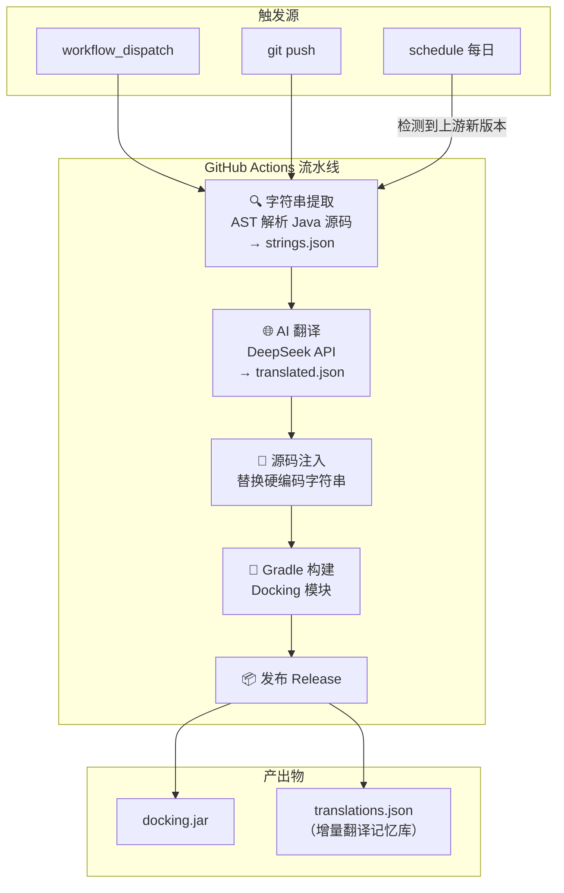

# Ghidra i18n 自动化流水线 — 项目计划

> AI 驱动的前端字符串提取 + 翻译 + 构建，基于 GitHub Actions + DeepSeek API

---

## 1. 项目概述

### 1.1 目标

将 Ghidra（NSA 逆向工程平台）的 UI 字符串自动翻译为简体中文（zh_CN），通过 GitHub Actions 全自动流水线完成「提取 → 翻译 → 注入源码 → 构建 → 发布」。

### 1.2 决策汇总

| # | 决策点 | 选择 |
|---|--------|------|
| 1 | 翻译注入方式 | **方案 A：直接修改 Java 源码**（就地替换硬编码字符串） |
| 2 | 目标语言 | **简体中文（zh_CN），单一语言** |
| 3 | AI 服务 | **DeepSeek，模型 deepseek-v4-flash** |
| 4 | 试点范围 | **Docking `widgets/` 模块**（~68 个 Java 文件，~2,100 条字符串字面量） |
| 5 | 字符串提取 | **方案 B：AST 解析提取所有字面量 + AI 带上下文分类与翻译** |
| 6 | 触发机制 | **手动触发 + push 触发 → pre-release；每日定时检查上游 → stable-release** |
| 7 | 上游跟踪 | **每日 1 次 cron 检查 Ghidra upstream 新 tag** |
| 8 | Ghidra 基线版本 | **Ghidra 12.1.2_build** |
| 9 | 源码修改方式 | **CI 就地修改**（ghidra/ 子模块内直接改 Java 文件） |
| 10 | 试点构建产出 | **只构建 Docking 模块，产出 docking.jar**（后续完整构建全量发行包） |
| 11 | 审核机制 | **全自动**（AI 翻译后直接修改源码、构建、发布） |
| 12 | 翻译中间格式 | **JSON**（`{original, context, translated}`） |

---

## 2. 架构总览



### 2.1 双轨发布策略

| 轨道 | 触发条件 | 产物类型 | 用途 |
|------|---------|---------|------|
| **pre-release** | push 到 main / workflow_dispatch | GitHub Pre-release | 开发验证、快速迭代 |
| **stable-release** | 上游 Ghidra 新正式版发布（每日检测） | GitHub Stable Release | 用户使用的稳定中文版 |

---

## 3. 流水线详细设计

### 3.1 阶段一：字符串提取（extract.py）

```
输入：ghidra/Ghidra/Framework/Docking/src/main/java/docking/widgets/*.java
输出：i18n-scripts/extract/output/strings.json
```

**工作流：**

1. **AST 解析**：使用 Python `javalang` 或 `tree-sitter-java` 解析每个 `.java` 文件
2. **字面量提取**：遍历 AST，找出所有 `StringLiteral` 节点
3. **上下文收集**：对每个字面量，记录：
   - `file`：源文件路径
   - `line`：行号
   - `class_name`：所在类名
   - `method_name`：所在方法名
   - `code_snippet`：包含该字面量的完整语句（前后各 3 行代码上下文）
4. **去重 + 去噪**：
   - 过滤纯数字/纯符号字面量
   - 过滤空字符串
   - 过滤明显的非 UI 字符串（如正则表达式、包名 `ghidra.*`、类名引用）
5. **输出 JSON**：

```json
[
  {
    "id": "docking_widgets_001",
    "file": "Ghidra/Framework/Docking/src/main/java/docking/widgets/OptionDialog.java",
    "line": 125,
    "original": "Cancel",
    "context": {
      "class": "OptionDialog",
      "method": "createButtonPanel",
      "code": "JButton cancelButton = new JButton(\"Cancel\");",
      "surrounding_lines": [
        "private JPanel createButtonPanel() {",
        "    JPanel buttonPanel = new JPanel();",
        "    ...",
        "    JButton cancelButton = new JButton(\"Cancel\");",
        "    cancelButton.addActionListener(e -> cancelCallback());",
        "    buttonPanel.add(cancelButton);"
      ]
    }
  }
]
```

**Python 依赖：**
- `javalang`（Python Java 解析器）或 `tree-sitter` + `tree-sitter-java`
- `json`

### 3.2 阶段二：AI 分类 + 翻译（translate.py）

```
输入：i18n-scripts/extract/output/strings.json
输出：i18n-scripts/translate/output/translated.json
```

**工作流：**

1. **读取 strings.json**
2. **已有翻译加载**：读取 `i18n-scripts/translate/output/translations_db.json`（翻译记忆库），跳过已有翻译的字符串（仅翻译新增/变更的）
3. **分批调用 DeepSeek API**：

   **Prompt 设计（每条消息含上下文）：**
   ```
   System: 你是专业的软件本地化翻译。将 Ghidra 逆向工程工具的 UI 字符串翻译为简体中文。
   翻译规则：
   - 保持技术术语一致性（如 "disassemble" → "反汇编"，"listing" → "列表视图"）
   - 保留占位符（如 %s, %d, {0}）
   - 保留 HTML 标签（如 <html>, <b>, <br>）
   - 保留快捷键标记（如 &File, _Open）
   - 对于非 UI 字符串（日志、调试信息、内部标识符），标注 skip
   - 按钮文字保持简洁（中文通常 2-4 字）
   - 菜单项保持层级语义

   User: 翻译以下 Java UI 字符串，附带源代码上下文：

   [每条：id, original, context.code, context.surrounding_lines]
   ```

   **API 调用参数：**
   - Model: `deepseek-v4-flash`
   - Temperature: `0.1`（保证一致性）
   - max_tokens: 根据批次大小动态设置

4. **汇总输出**：

```json
[
  {
    "id": "docking_widgets_001",
    "original": "Cancel",
    "translated": "取消",
    "type": "ui_button",
    "source_file": "...",
    "source_line": 125
  }
]
```

5. **更新翻译记忆库**：追加/更新 `translations_db.json`

**Python 依赖：**
- `openai`（DeepSeek 兼容 OpenAI SDK）
- `json`

### 3.3 阶段三：源码注入（inject.py）

```
输入：i18n-scripts/translate/output/translated.json
操作：修改 ghidra/ 子模块中对应用 Java 源文件
```

**工作流：**

1. 读取 `translated.json`
2. 按 `source_file` 分组
3. 对每个源文件：
   - 读取原始内容
   - 按 `source_line` 定位每一处需替换的字面量
   - 执行精确替换（`"Cancel"` → `"取消"`）
   - **安全校验**：替换前确认该行的字符串与 `original` 完全匹配，不匹配则跳过并报 warning
4. 写回文件

**注意风险：**
- 同一行可能有多个相同字符串（如 `"OK"` 出现两次），需结合上文区分
- 字符串可能跨多行（Java 字符串拼接），AST 解析已处理

### 3.4 阶段四：构建（Gradle）

```bash
cd ghidra
./gradlew :Docking:jar
```

- 构建产物：`ghidra/Ghidra/Framework/Docking/build/libs/docking.jar`
- Ghidra 构建需要 JDK 21 + Gradle
- 当前 `gradle.properties` 有 `-Duser.language=en -Duser.country=US`（JVM 参数强设英文 locale），由于我们直接修改源码中的字符串，此设置不影响中文显示

### 3.5 阶段五：发布

- **pre-release**：上传 `docking.jar` + `translated.json` 作为 GitHub Pre-release artifacts
- **stable-release**：构建完整 Ghidra 发行包 + 上传完整 artifacts + `translated.json`

---

## 4. 仓库目录结构

```
ghidra-i18n/
├── .github/
│   └── workflows/
│       ├── pre-release.yml          # push/manual 触发 → pre-release
│       └── stable-release.yml       # 每日检查上游 → stable-release
├── ghidra/                          # Git 子模块（NSA Ghidra 上游）
├── i18n-scripts/
│   ├── extract/
│   │   ├── extract.py               # AST 解析 + 字符串提取
│   │   └── output/
│   │       └── strings.json         # 提取结果（git-ignored）
│   ├── translate/
│   │   ├── translate.py             # DeepSeek API 翻译
│   │   └── output/
│   │       ├── translated.json      # 本次翻译结果（git-ignored）
│   │       └── translations_db.json # 翻译记忆库（纳入 git，增量复用）
│   ├── inject/
│   │   └── inject.py                # 源码注入
│   └── requirements.txt             # Python 依赖
├── doc/
│   └── PLAN.md                      # 本文件
├── .ghidra-version                  # 当前跟踪的 Ghidra 版本
├── .gitignore
└── .gitmodules
```

---

## 5. GitHub Actions Workflow 设计

### 5.1 `pre-release.yml`（push / manual → pre-release）

```yaml
name: Pre-Release Build

on:
  push:
    branches: [main]
  workflow_dispatch:

jobs:
  i18n-build:
    runs-on: ubuntu-latest
    steps:
      - name: Checkout
        uses: actions/checkout@v4
        with:
          submodules: true

      - name: Setup Python
        uses: actions/setup-python@v5
        with:
          python-version: '3.12'

      - name: Setup JDK 21
        uses: actions/setup-java@v4
        with:
          java-version: '21'
          distribution: 'temurin'

      - name: Install Python deps
        run: pip install -r i18n-scripts/requirements.txt

      - name: Extract strings (AST)
        run: python i18n-scripts/extract/extract.py

      - name: AI Translate (DeepSeek)
        env:
          DEEPSEEK_API_KEY: ${{ secrets.DEEPSEEK_API_KEY }}
        run: python i18n-scripts/translate/translate.py

      - name: Inject translations
        run: python i18n-scripts/inject/inject.py

      - name: Build Docking module
        run: cd ghidra && ./gradlew :Docking:jar

      - name: Upload artifacts
        uses: actions/upload-artifact@v4
        with:
          name: docking-i18n
          path: |
            ghidra/Ghidra/Framework/Docking/build/libs/docking.jar
            i18n-scripts/translate/output/translated.json

      - name: Create Pre-Release
        uses: softprops/action-gh-release@v2
        with:
          prerelease: true
          tag_name: pre-${{ github.run_number }}
          files: |
            ghidra/Ghidra/Framework/Docking/build/libs/docking.jar
            i18n-scripts/translate/output/translated.json
```

### 5.2 `stable-release.yml`（每日检查上游 → stable-release）

```yaml
name: Stable Release Check

on:
  schedule:
    - cron: '0 2 * * *'   # 每天 UTC 2:00（北京时间 10:00）
  workflow_dispatch:

jobs:
  check-upstream:
    runs-on: ubuntu-latest
    outputs:
      new_version: ${{ steps.check.outputs.new_version }}
    steps:
      - name: Checkout
        uses: actions/checkout@v4

      - name: Check upstream Ghidra tag
        id: check
        run: |
          LATEST=$(gh api repos/NationalSecurityAgency/ghidra/git/refs/tags \
            --jq '.[].ref' | grep 'Ghidra_[0-9]' | sort -V | tail -1 | sed 's|refs/tags/||')
          CURRENT=$(cat .ghidra-version)
          echo "Latest upstream: $LATEST"
          echo "Current tracked: $CURRENT"
          if [ "$LATEST" != "$CURRENT" ]; then
            echo "new_version=$LATEST" >> $GITHUB_OUTPUT
            echo "Upstream has new version!"
          else
            echo "No new version."
          fi
        env:
          GH_TOKEN: ${{ github.token }}

  stable-build:
    needs: check-upstream
    if: needs.check-upstream.outputs.new_version != ''
    runs-on: ubuntu-latest
    steps:
      - name: Checkout
        uses: actions/checkout@v4
        with:
          submodules: true

      - name: Update submodule to new version
        run: |
          cd ghidra
          git fetch origin tag ${{ needs.check-upstream.outputs.new_version }}
          git checkout ${{ needs.check-upstream.outputs.new_version }}
          echo "${{ needs.check-upstream.outputs.new_version }}" > ../.ghidra-version

      - name: Setup Python + JDK
        # ... 同 pre-release

      - name: Extract → Translate → Inject → Build
        # ... 同 pre-release

      - name: Create Stable Release
        uses: softprops/action-gh-release@v2
        with:
          tag_name: ${{ needs.check-upstream.outputs.new_version }}-zh_CN
          name: "Ghidra ${{ needs.check-upstream.outputs.new_version }} 中文版"
          files: |
            ghidra/Ghidra/Framework/Docking/build/libs/docking.jar
            i18n-scripts/translate/output/translated.json
```

---

## 6. 关键技术挑战与对策

### 6.1 字符串识别准确度

| 挑战 | 对策 |
|------|------|
| 代码中大量非 UI 字符串（日志、debug 信息、异常消息） | AI 根据上下文判断；prompt 明确指示 skip 非 UI |
| 字符串可能是变量值/配置项（如 `"Cancel"` vs `"true"`） | AST 分析该字面量所在语句类型（`new JButton(...)` vs `put("key", ...)`） |
| 同一行多个相同字符串 | inject.py 按行号 + 字符串匹配 + 上下文校验三重定位 |

### 6.2 AI 翻译质量

| 挑战 | 对策 |
|------|------|
| 逆向工程术语一致性问题（如 common terms 多次出现） | 翻译记忆库 `translations_db.json` 保证一致性 |
| HTML 标签、占位符、快捷键标记被破坏 | Prompt 明令禁止修改；inject 后正则校验 |
| API 调用成本（~2,000 字面量 × tokens） | 翻译记忆库增量复用，只翻译新字符串；一次翻译可多次构建 |

### 6.3 构建环境

| 挑战 | 对策 |
|------|------|
| Ghidra 构建需要特定 JDK 版本 | GitHub Actions `setup-java` 指定 JDK 21 |
| Gradle 构建可能因网络下载依赖失败 | 使用 `gradle/wrapper`；actions/cache 缓存 `.gradle` |
| `gradle.properties` 强制 `-Duser.language=en` | 源码层面替换字符串，不受影响 |

### 6.4 子模块管理

| 挑战 | 对策 |
|------|------|
| CI 中修改子模块文件导致 dirty state | checkout 时 `submodules: true`；构建后不提交回子模块 |
| 上游更新时子模块冲突 | stable-release 工作流先 fetch tag → checkout → 构建新版本 |

---

## 7. 里程碑

| 阶段 | 内容 | 预计产出 |
|------|------|---------|
| **M1: 基础设施** | 搭建 i18n-scripts 骨架、GitHub Actions 空模板、Python 依赖安装 | 可运行的空流水线 |
| **M2: 字符串提取** | 实现 `extract.py`（AST 解析 Docking widgets/ 68 个 Java 文件） | `strings.json`（~500-800 条有效 UI 字符串） |
| **M3: AI 翻译** | 实现 `translate.py`（DeepSeek API 集成、翻译记忆库） | `translated.json`（中文翻译映射表） |
| **M4: 源码注入** | 实现 `inject.py`（字符串替换 + 安全校验） | 修改后的 Java 源码 |
| **M5: 构建 + 发布** | Gradle 构建 Docking 模块 + GitHub Release | `docking.jar` 发布为 pre-release |
| **M6: 上游跟踪** | stable-release 工作流（cron 检查 + 自动更新子模块） | 新版本中文版自动发布 |
| **M7: 扩展（后续）** | 扩展至 Docking 全模块 → Features/Base → 完整 Ghidra | 完整 Ghidra 中文版 |

---

## 8. 待确认 / 后续议题

1. **DeepSeek API 计费模式确认**：`deepseek-v4-flash` 的具体定价和 token 限制，需评估全量翻译成本
2. **AST 解析器选型**：`javalang`（纯 Python，简单）vs `tree-sitter-java`（更快但需要编译），建议先试 `javalang`
3. **Docking 构建产物验证**：翻译后的 `docking.jar` 如何挂载到 Ghidra 运行环境进行人工验证？
4. **完整 Ghidra 发行包构建**：后续步骤中，stable-release 需构建完整 zip/tar.gz，需确认 GitHub Actions runner 规格（建议至少 4-core + 16GB RAM）
5. **`gradle.properties` 的 `user.language=en` 强制设置**：全量中文版最终可能需要移除或改为 `zh-CN`

---

*计划版本: v1.0 | 日期: 2026-06-08*
